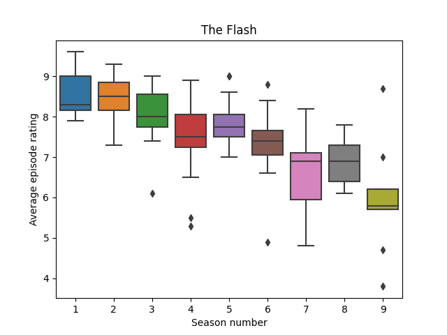

# IMDb statistics

Using [IMDb dataset](https://www.imdb.com/interfaces/) to create some stats about series

## Usage

First install dependencies:

```console
poetry install
```

To see how much of given show have you already watched (and what you have left):

```console
poetry run python imdb-series-ratings.py -n "Community" completion -s 4 -e 2
Completed 72 episodes with 38 left from 110 episodes total (65.45%)
Watched 1580 minutes (26h 20min) with 895 minutes left (14h 55min) from 2475 minutes total (26h 20min) (63.84%)
Series episodes were released in 2009-2015

- In season 4 (2013) there are 12 remaining episodes with total runtime of 261 minutes (4h 21min) (10.55% of whole series)
- In season 5 (2014) there are 13 remaining episodes with total runtime of 272 minutes (4h 32min) (10.99% of whole series)
- In season 6 (2015) there are 13 remaining episodes with total runtime of 362 minutes (6h 2min) (14.63% of whole series)
```

Note that depending on your computer performance it may take a while (~2mins).

To show box plot of ratings from series seasons:

```console
poetry run python imdb-series-ratings.py -i 'tt3107288' box
```


